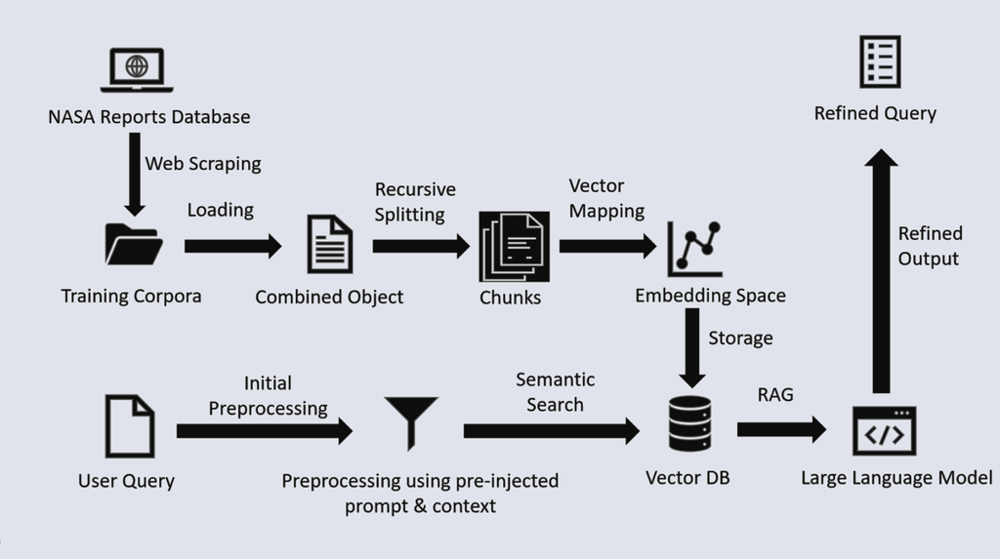
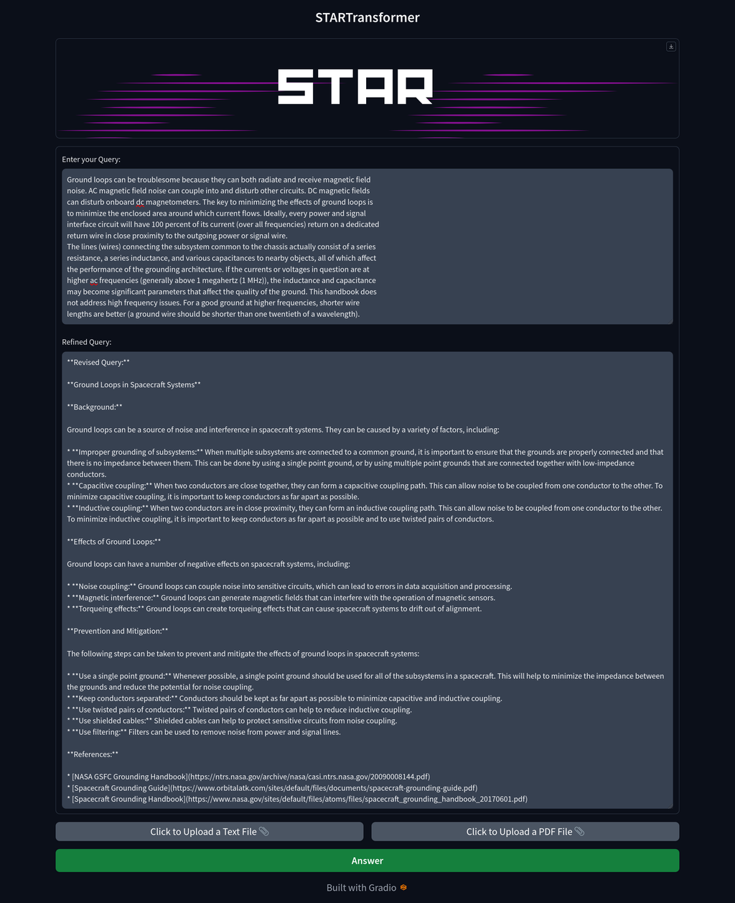
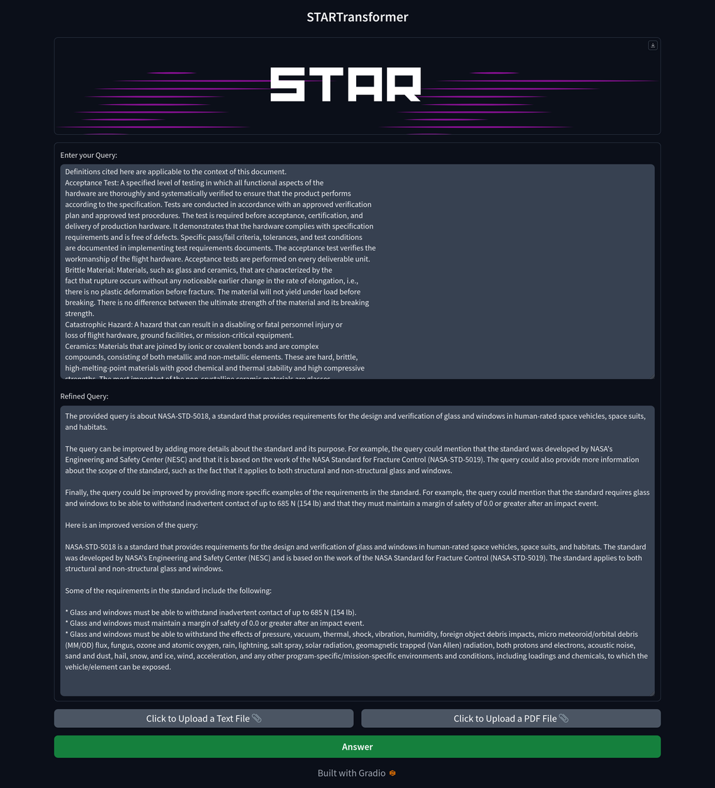

# STARTransformers

## High-Level Summary

Our Innovation: Our project is an all-encompassing answer to the STAR Challenge, with the goal of revolutionising how NASA manages technical requirements. We have created a sophisticated application powered by Natural Language Processing (NLP) and equipped with robust security measures.

### This application responds to the difficulty by:

1. Generation of Exceptional Descriptions: Our application uses natural language processing to generate clear and precise descriptions of technical requirements, removing ambiguity and improving the quality of mission-critical documents. We provide a user-friendly API, which makes integration into NASA's existing workflow seamless and effective.
2. Robust Cyber-security: We ensure data security by encrypting APIs with AES, air-gapping the LLM Interface using docker, user authentication and further whitelisting computer IPs thereby protecting sensitive information, and adhering to ITAR and EAR regulations.
3. Integration of Augmented Reality (Future Prospect): As a futuristic feature, we intend to integrate AR capabilities into our app, thereby enhancing astronaut and worker safety, guidance, and emergency support. Its Importance: Our project is essential for a number of reasons:

``` text
(1) Accuracy and Clarity: Our app improves the safety and success of space missions by enhancing the precision and clarity of technical requirements, thereby reducing the likelihood of errors. Adoption by Users: The user-friendly API ensures that NASA personnel can readily adopt our solution, streamlining their document management processes. (3) Information Security: Our robust cyber-security safeguards protect sensitive data in accordance with national regulations and ethical obligations. (4) Future-Oriented: The planned incorporation of augmented reality demonstrates our commitment to innovation and safety in space exploration, thereby making our solution adaptable to changing requirements. In conclusion, our project comprehensively answers the STAR Challenge by addressing document-related issues and preparing for the future with cutting-edge augmented reality capabilities. It improves the quality of technical requirements, increases user adoption, guarantees data security, and paves the way for safer and more productive space missions.
```

## Project Demo

[Presentation](https://drive.google.com/drive/folders/1Mao7I1xPxqVPY-fchmDJxHEjvqwA-sA0?usp=sharing)

## Final Project

[Github](https://github.com/SparshRastogi/STARTransformers)

## Project Details

### Detailed Description of STAR Transformers:

Our project is an advanced application designed to address the STAR Challenge by NASA. It is a multifaceted solution with a strong emphasis on enhancing the management of technical requirements, bolstering safety, and preparing for future challenges.

### Notable Features:

1. Generation of Descriptions Using Natural Language Processing: Our application analyses and generates precise descriptions of technical requirements using Natural Language Processing (NLP) algorithms. This resolves the issue of ambiguity in problem descriptions, ensuring that mission-critical documents are precise and clear.
2. Friendly API : We have created a user-friendly Application Programming Interface (API) to integrate our solution seamlessly into NASA's existing workflow. This simplifies the adoption procedure and enables NASA personnel to incorporate our document management tool with ease.
3. Cyber-security: Data protection is of the utmost importance. To protect all data and communications within our application, we've implemented Advanced Encryption Standard (AES) encryption on the APIs using JSON Web Tokens (JWTs). This ensures the confidentiality and integrity of sensitive information, including national security-sensitive data as required by the ITAR and EAR. Further, model itself will be containerized using docker and can only be accessed through APIs. User Authentication and whitelisting of IPs ensure only trusted users can access system
4. Integration of Augmented Reality (AR) (Future Prospect): As part of our forward-thinking strategy, we intend to incorporate augmented reality capabilities into our application. This AR system will feature the following capabilities:

- Safety Improvements: It will use infrared cameras to identify potentially dangerous areas by detecting overheated equipment or exposed wiring. This information is crucial for ensuring the safety and success of astronauts and missions.
- Direction and Support: The augmented reality system can mark and direct astronauts and workers to particular switches, components, and locations. This helps locate essential equipment quickly and precisely.
- Checklists and Emergency Assistance: In emergency situations, the AR system can provide astronauts with step-by-step instructions, ensuring that emergency procedures are carried out correctly.

### How does it work?

Our project works in the following manner:

1. Firstly, we scraped several NASA research papers, technical bulletins, engineering reports, lessons learned, NTRS reports etc. and other relevant material that could be insightful and complementary in completing the ambiguities of the query. The web scraping was performed using BeautifulSoup and resulted into a corpora of documents to use in our model
2. After that we loaded the data from Corpora using PyPDF module into a single object that could be used for further preprocessing
3. Then using RecursiveCharacterTextSplitter of Langchain module, we divided the above data into various chunks of information which could be used for Retrieval Augmented Generation(RAG)
4. We then mapped these chunks of textual data into a vector space using BGE embeddings(the topmost performing open source embeddings on HuggingFace leaderboard)
5. These vector embeddings were then subsequently stored into a vector store using FAISS CPU which could now then be retrieved using the vector similarity search for Retrieval Augmented Generation
6. Now whenever a query is fed into the system firstly it will be processed through a pre-injected custom prompt and context in order to identify the ambiguities, generalities or any other issues
7. Then after identifying the issues it will perform a semantic search through the vector store in order to retrieve the most relevant chunks of information in order to resolve the ambiguity or suggest better mechanisms
8. Ultimately the retrieved vectors will be fed to a LLM(currently using PaLM API due to resource constraints) which will transform these vectors into a proper response as per a pre-specified format which includes ambiguities and their potential impacts, the Improvised version and the sources on basis of which it made the recommendation

### Benefits & Objectives

Our solution has the following benefits which will improve the current mechanism increasing efficiency and reducing errors:

- Mission Success: Precise requirements will ensure that everyone understands their roles properly, minimizing errors that may imperil missions and astronaut safety.
- Resource Optimization: By incorporating insights from past missions, standards can be improved with better mechanisms thus to leading to reduced costs and efficient resource utilization
- Innovation: Clear and concise standards will lay the groundwork for inventive solutions, fostering innovation in future space exploration.
- Global Collaboration: Uniform and unambiguous standards will facilitate effective cooperation among international partners on forthcoming space missions.
- Ethical Responsibility: Well-defined requirements criteria will steer ethical decision-making in space exploration, guaranteeing responsible and secure practices in the future.
- Enhanced Aerospace Design: Augmented Reality integration will significantly improve aerospace design,offering engineers more intuitive and immersive tools for visualizing and refining complex aircraft and spacecraft components, ultimately enhancing precision and efficiency in the development process.

### Tools, Technologies and Other Resources

Our application was built using the following tools, programming languages, and technologies:

- NLP(Natural Language Processing)
- AR(Augmented Reality)
- Python
- JavaScript
- Google Palm
- Langchain
- FAISS
- BGE Embeddings and for NLP processing.  
- ARCore (for Android) augmented reality features.
- Gradio
- PHP as a backend server
- JSON Web Tokens (JWT)
- AES Encryption for encrypting APIs
- Docker for containerization and air-gapping the LLM Interface

Our project aims to significantly enhance the precision and clarity of technical requirements, streamline their management, strengthen data security, and prepare for the future with augmented reality capabilities. We hope to contribute to the success of space missions and the advancement of the aerospace industry overall.

### Here is the implementation:



### Our Prototype:




### Use of Artificial Intelligence

Yes, our solution relies heavily on Artificial Intelligence tools and software to achieve its goals, particularly in the field of Natural Language Processing (NLP) and future incorporation of Augmented Reality (AR). Here is how we employ our AI:

1. Analyse and comprehend intricate technical documents.
2. Generate precise and unambiguous technical requirements descriptions.
3. Determine the documents' inconsistencies, errors, and omissions.
4. Provide effective suggestions for improving the document.
5. NLP enables our application to improve the quality of technical requirements and remove ambiguity, which contributes to the success and safety of space missions.

### Space Agency Data

- [NASA Standards](https://standards.nasa.gov/all-standards)
- [NASA Standard 5018, Strength Design and Verification Criteria for Glass, Ceramics, and Windows in Human Space Flight Applications](https://standards.nasa.gov/standard/nasa/nasa-std-5018)
- [NASA Engineering and Safety Center (NESC) Technical Bulletins](https://www.nasa.gov/nesc/technicalbulletins)
- [NESC Technical Bulletins Summary](https://www.nasa.gov/sites/default/files/atoms/files/tb_summary_091922.pdf)
- [NASA Lessons Learned](https://llis.nasa.gov/)
- [NASA Technical Reports Server (NTRS)](https://ntrs.nasa.gov/)
- [NASA Knowledge Management](https://www.nasa.gov/content/knowledge-management-km-resources)
- [NASA Scientific and Technical Information (STI) Program](https://sti.nasa.gov/)

### References

[BGE Embeddings](https://huggingface.co/BAAI/bge-large-en)
